```mermaid
flowchart TD

    %% Pipeline principal
    update_software_metadata --> read_software_entries
    update_software_metadata --> extract_software_repositories
    update_software_metadata --> fetch_github_repo_metadata
    update_software_metadata --> update_software_entries_github
    update_software_metadata --> compute_software_weights
    update_software_metadata --> write_software_entries

    %% Lecture des entrées
    read_software_entries --> list_software_md_files
    read_software_entries --> read_md_file
    read_software_entries --> parse_toml_frontmatter

    list_software_md_files --> path_software
    read_md_file --> path_software

    %% Extraction des dépôts
    extract_software_repositories --> extract_software_repository

    %% GitHub
    fetch_github_repo_metadata --> validate_repository_table
    fetch_github_repo_metadata --> split_repo_batches
    fetch_github_repo_metadata --> fetch_github_repo_batch
    fetch_github_repo_metadata --> normalize_github_metadata

    fetch_github_repo_batch --> build_github_graphql_query
    fetch_github_repo_batch --> parse_github_repo_response

    %% Mise à jour des entrées
    update_software_entries_github --> update_software_entry_github
    update_software_entry_github --> update_github_section

    %% Calcul des poids
    compute_software_weights --> extract_software_metrics

    %% Écriture
    write_software_entries --> has_metadata_changed
    write_software_entries --> serialize_toml
    write_software_entries --> write_md_file

    has_metadata_changed --> serialize_toml
    write_md_file --> path_software
```

```
portfolio/
├── config.toml
├── content/
│   ├── _index.md                     # Accueil
│   │
│   ├── about/
│   │   └── index.md
│   │
│   ├── projects/
│   │   ├── _index.md                 # Liste des projets
│   │   ├── project-a/
│   │   │   ├── index.md              # Frontmatter + description
│   │   │   ├── screenshot.webp
│   │   │   ├── architecture.svg
│   │   │   └── logo.png
│   │   └── project-b/
│   │       ├── index.md
│   │       └── ...
│   │
│   ├── software/
│   │   ├── _index.md
│   │   ├── software-a/
│   │   │   ├── index.md
│   │   │   └── screenshot.webp
│   │   └── software-b/
│   │
│   ├── databases/
│   │   ├── _index.md
│   │   ├── database-a/
│   │   │   ├── index.md
│   │   │   └── schema.svg
│   │   └── ...
│   │
│   ├── publications/
│   │   ├── _index.md
│   │   ├── publication-a/
│   │   │   ├── index.md
│   │   │   └── cover.webp
│   │   └── ...
│   │
│   ├── teaching/
│   │   ├── _index.md
│   │   ├── course-a/
│   │   │   ├── index.md
│   │   │   └── cover.webp
│   │   └── ...
│   │
│   ├── notes/
│   │   ├── _index.md
│   │   ├── first-note.md
│   │   ├── second-note.md
│   │   └── ...
│   │
│   └── contact/
│       └── index.md
│
├── static/
│   ├── favicon.ico
│   ├── fonts/
│   ├── icons/
│   └── downloads/
│
├── sass/
│   ├── main.scss
│   ├── _variables.scss
│   ├── _layout.scss
│   ├── _cards.scss
│   ├── _navbar.scss
│   ├── _footer.scss
│   └── _notes.scss
│
├── templates/
│   ├── base.html
│   ├── index.html
│   ├── about.html
│   ├── projects.html
│   ├── software.html
│   ├── databases.html
│   ├── publications.html
│   ├── teaching.html
│   ├── notes.html
│   ├── note.html
│   ├── contact.html
│   │
│   ├── partials/
│   │   ├── head.html
│   │   ├── navbar.html
│   │   ├── footer.html
│   │   ├── social.html
│   │   ├── card.html
│   │   ├── badge.html
│   │   ├── links.html
│   │   └── pagination.html
│   │
│   └── macros/
│       ├── cards.html
│       ├── tags.html
│       └── icons.html
│
└── README.md
```

- Zola SSG
- Pico CSS (variante Class Less and Centered Viewport)
- Custom CSS
- Nord theme (Dark & Light)
- Lucide & Simple Icons (icônes en local - opinionated selection)
- Build & Deploy via GitHub Pages

Static Site Generator:
  - https://www.getzola.org

Framework CSS:
  - https://picocss.com

Icons:
  - https://lucide.dev
  - https://simpleicons.org

Color palette:
  - https://www.nordtheme.com

Fonts:
  - https://github.com/rsms/inter
  - https://github.com/tonsky/FiraCode


```
update_software_metadata()               ✅
│
├── read_software_entries()              ✅    
│   ├── list_software_md_files()         ✅
│   │   └── path_software()              ✅
│   ├── read_md_file()                   ✅
│   └── parse_toml_frontmatter()         ✅
│
├── extract_software_repositories()      ✅
│   └── extract_software_repository()    ✅
│
├── fetch_github_repo_metadata()         ✅
│   ├── validate_repository_table()      ✅
│   ├── split_repo_batches()             ✅
│   ├── fetch_github_repo_batch()        ✅
│   │   ├── build_github_graphql_query() ✅
│   │   └── parse_github_repo_response() ✅
│   └── normalize_github_metadata()      ✅
│
├── update_software_entries_github()     ✅ 
│   ├── update_github_section()          ✅
│   └── update_software_entry_github()   ✅
│
├── compute_software_weights()           ✅
│   └── extract_software_metrics()       ✅
│
├── has_metadata_changed()               ✅
│   └── serialize_toml()                 ✅
│
└── write_software_entries()
    ├── serialize_toml()                 ✅
    └── write_md_file()                  ✅
```

